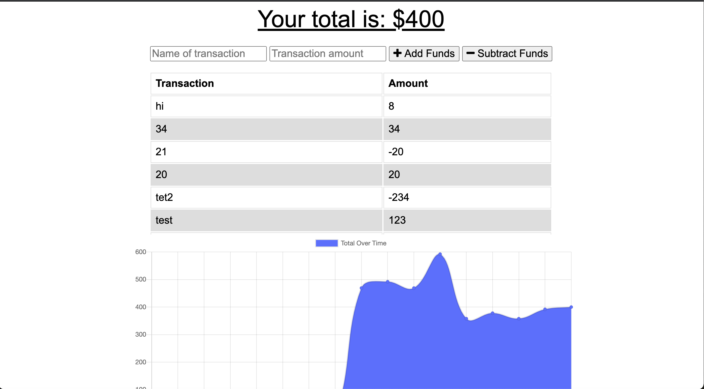

# Budget Tracker 

  
   
  ## Description
  :mag: 
  Budget Tracker is a way to keep track of your expenses. You are able to post transactions for both adding and subtracting funds. The application can work on or offline so feel free to add as you go!
  

  ## Table of Contents
  - [Description](#description)
  - [Installation](#installation)
  - [Usage](#usage)
  - [License](#license)
  - [Contributing](#contributing)
  - [Tests](#tests)
  - [Questions](#questions)
  ## Installation
  :floppy_disk: 
  You can clone the project (prerequisite: node.js, indexDB, mongoose, mongooseDB, install dependencies) and be able to function the budge tracker!
  ## Usage
  :computer:  This application can be used for people who need to manage their money better or keep track of their finances for investing!
  ## License
  
  This project was made without a license.
  ## Contributing
  :innocent: Anyone is able to contribute to the project!
  ## Tests
  :exclamation: 
    Run the application and be able to add some funds for fun to test the system. You can remove you data once you are ready to start managing money for real.
  ## URL

  ## Questions
  :alien: email me! 
   
  :octocat: Find me on GitHub: [connerc11](https://github.com/connerc11) 
   
  :speech_balloon: Email: cccochrane1@knights.ucf.edu  
  